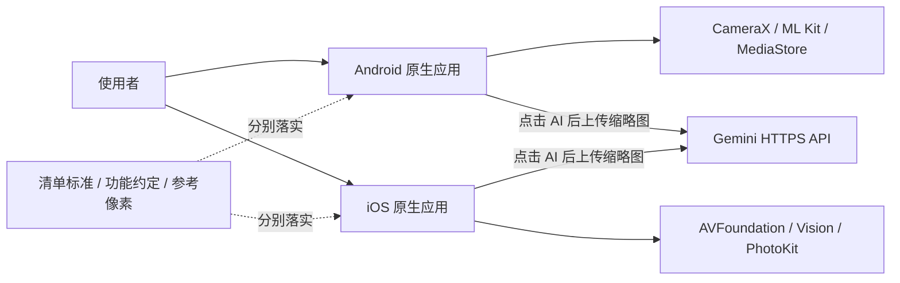
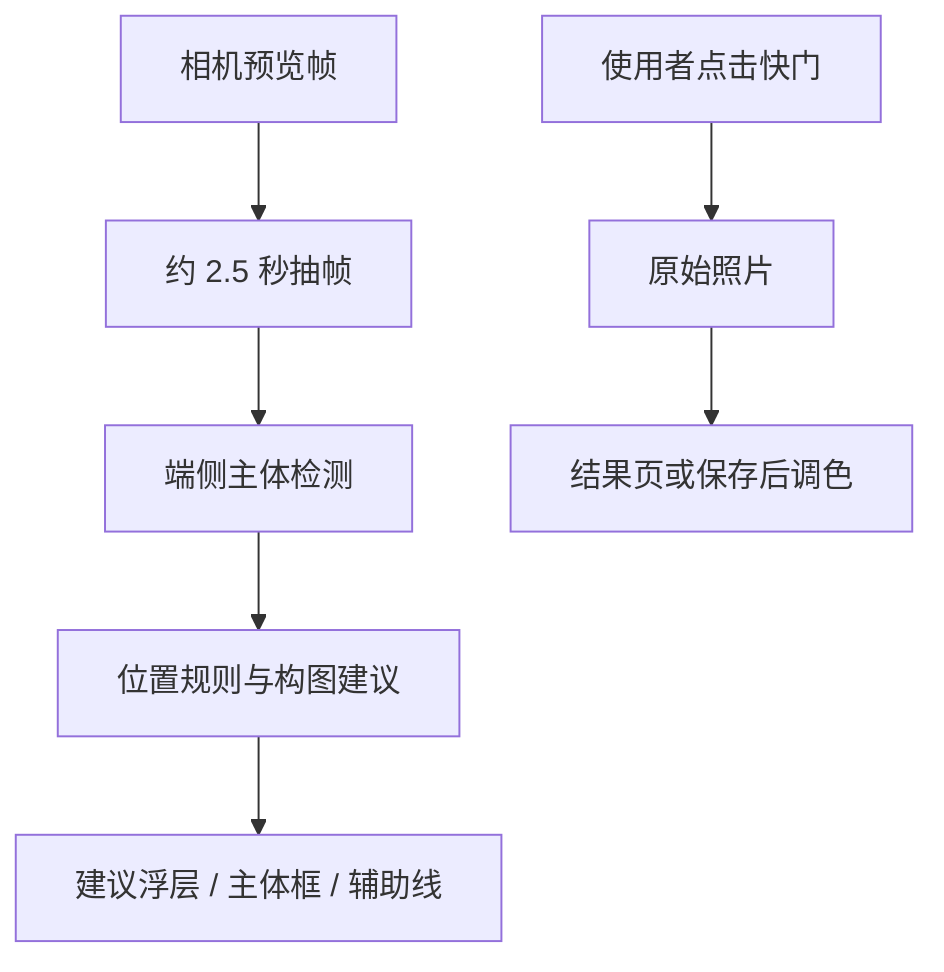
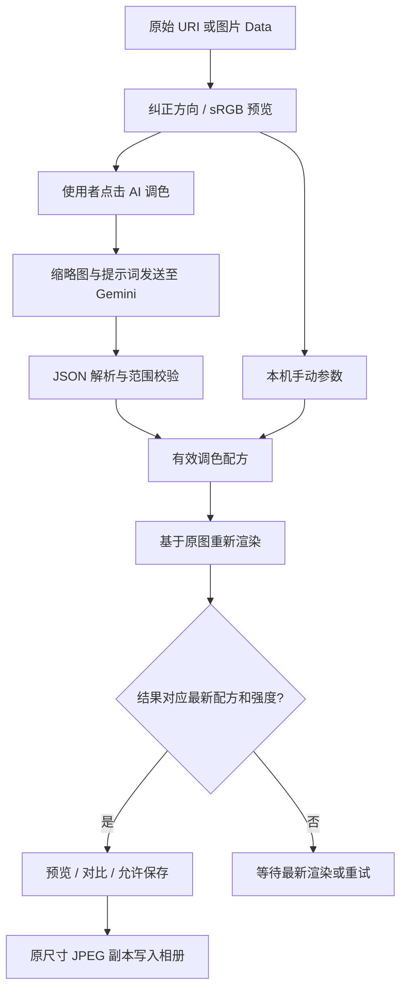
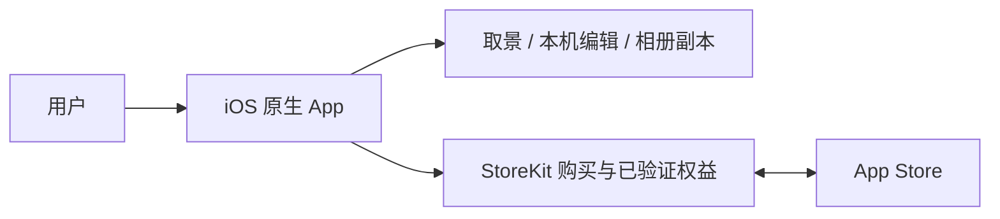
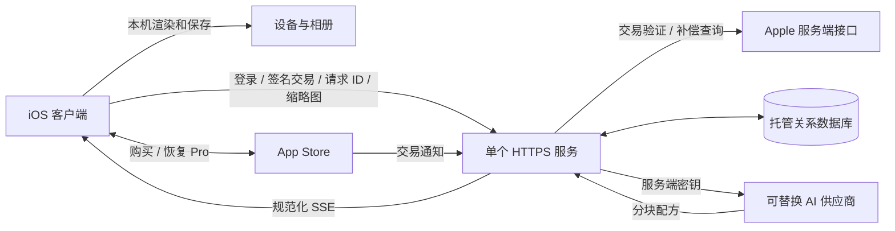

# CompositionHelper 双端架构

更新：2026-09-10。当前实现基线：Android 流式版本 `08a7451`、iOS 流式版本 `a96bfc4`。第 1–8 节和流式补充描述已实现能力；第 9 节起为商业化目标设计，尚未实现。产品方向见 [产品定位与商业化路线](PRODUCT_STRATEGY.md)；目标规范见 [UI 与交互约定](DESIGN_SYSTEM.md)，缺口见 [已知问题](KNOWN_ISSUES.md)。源码路径按所属分支查看。

## 1. 系统边界

这是一个仓库中的两套原生应用：`master` 是 Kotlin/Jetpack Compose，`ios` 是 Swift/SwiftUI。没有共享运行时、跨平台 UI 框架或自建业务后端。两端以功能约定、清单 JSON 和参考像素建立一致性；修改一端不会自动更新另一端。

实时构图建议在设备上处理；拍后 AI 调色才调用 Gemini。建议分数不等于经校准的审美评分。没有对象分割、生成式重绘、用户账号服务或检查记录云同步。

## 2. 模块与职责

| 职责 | Android：master | iOS：ios |
|---|---|---|
| 应用入口与导航 | `MainActivity.kt`、`CompositionHelperNavigation`；Navigation Compose | `CompositionHelperApp.swift`、`ContentView.swift`；SwiftUI sheet/cover |
| 实时相机 | `camera/CameraCompositionScreen.kt`、`CameraManager.kt` | `Camera/CameraCompositionView.swift`、`CameraManager.swift` |
| 实时检测与建议 | `camera/FrameAnalyzer.kt`、ML Kit | `Camera/FrameAnalyzer.swift`、Vision |
| 静态构图分析 | `ImageAnalyzer.kt`、`CompositionHelperApp.kt` | `Analyzers/CompositionAnalyzer.swift`、`Views/CompositionHelper.swift` |
| 辅助线及坐标 | `overlay/`、`camera/CameraGeometry.kt`、`model/SpiralGeometry.kt` | `Views/Overlays/CompositionOverlays.swift`、`Models/CompositionType.swift` |
| 调色编辑状态 | `color/ColorEditorScreen.kt`，Compose 状态与协程 | `Color/ColorEditorModel.swift`，ObservableObject / MainActor |
| 配方与像素处理 | `color/ColorPlan.kt`、`ColorPlanEngine.kt` | `Color/ColorPlan.swift`、`ColorPixelEngine` |
| 图片读取与保存 | `color/ColorPhotoStore.kt` | `Color/ColorPhotoService.swift` actor |
| AI 通信 | `GeminiColorClient.kt`、`GeminiColorProtocol.kt` | `GeminiColorService`，位于 `ColorPhotoService.swift` |
| 真人清单 | `checklist/ShootingChecklistScreen.kt` | `Components/ShootingChecklistView.swift` |

Android 源码根目录为 `app/src/main/java/com/example/compositionhelper/`，iOS 为 `Sources/`。模块是源码职责划分，不是独立发布的 SDK。

## 3. 页面入口与导航

Android 默认进入 `camera`，另有 `gallery`、`samples`、`color?uri=...` 路由。快门保存原片后把 URI 交给调色页面。清单作为相机上的全屏 Dialog，不属于单独导航路由。

iOS 默认展示 `CameraCompositionView`；相机可打开调色 sheet、清单 sheet，以及拍摄结果 fullScreenCover。拍摄结果可以再进入调色。`CompositionHelperView` 静态相册分析页面存在，但 `ContentView.showGalleryMode` 当前没有置为 true 的路径，相机底部相册图标调用 dismiss，因此不能把“相册分析主入口”当作已连通。调色页自身的 PhotosPicker 仍可用于导入照片。

## 4. 实时相机数据流

Android 用 CameraX ViewPort 关联预览、检测与照片画幅；几何辅助函数处理旋转和裁剪。退出时关闭检测器及相机会话，过期帧结果有过滤。iOS 在串行 `sessionQueue` 配置 AVFoundation，会话输入复用；Vision 结果回主线程发布。两端的坐标映射实现不同，不能用 Android 几何测试替代 iOS 真机框线对齐检查。

19 种辅助线不代表智能算法覆盖全部 19 种构图。拍照预览比例、成片裁切和旋转必须通过真实照片核对。

## 5. 拍后调色数据流

管线顺序：基础七参数 → 九点曲线 → HSL 色域 → 明暗色彩平衡 → RGB 校色 → 总强度混合。曲线/HSL/色彩平衡可来自 AI；当前手动面板主要编辑基础项、RGB 和总强度。RGB 原色与互补模式是不同运算，不可当成等价白平衡。

Android 的预览通过 `LaunchedEffect` 按源图、配方和强度重启；`renderedRecipe/renderedStrength` 防止保存旧结果。iOS 用任务取消、generation 标识和 `renderedPlan/renderedStrength` 判断 `ready`。两端都保留最多 20 次撤销快照；Android 部分编辑状态支持 Compose 状态恢复，iOS 编辑状态仅属于当前编辑器实例。

Android 使用 IO/Default 调度器读取和计算；iOS 图片工作在 actor，界面状态在 MainActor。当前都是 CPU 像素处理，原尺寸导出仍需实测内存及耗时。iOS 预览最长边 1400，导出超过 3200 万像素会明确拒绝；Android 采用自己的采样规则，不能假定同一预览尺寸。

## 6. 网络与数据边界

只有主动点击 AI 才发送重新编码的 JPEG 缩略图及提示词；不附原片 EXIF。网络固定到 Gemini HTTPS 接口，两端均禁止重定向并限制响应大小。API Key 放请求头，不写进安装包、日志或持久化设置。

Android Key 保存在进程级 `GeminiColorSession`；iOS 保存在当前 `ColorEditorModel`。生命周期并不相同。应用不代理 Apple 账号登录；iloader 属于外部安装工具。详细数据去向见 [数据与隐私](DATA_PRIVACY.md)。

## 7. 真人清单状态

标准为 [SHOOTING_CHECKLIST.json](SHOOTING_CHECKLIST.json)：3 组、12 个稳定 ID。原生代码各保留一份条目，运行时不读取这个 JSON；因此变更时必须同步 JSON 和两端代码，不能只修改文档。

状态为 `pending / confirmed / problem / skipped`，缺失或未知状态按待检查处理。只有使用者操作状态菜单才会改变结果。`confirmed` 计入已确认；问题和不适用单独计数。它不是自动测试服务，也不读取相机或 AI 成功信号来勾选。

Android 保存到 `shooting_checklist` SharedPreferences；iOS 用标准 UserDefaults / AppStorage。键为 `shooting.checklist.v1` 和 `shooting.checklist.notes.v1`。状态采用 `id=state;...` 字符串，备注单独保存。重置需确认，清空本轮记录不删除照片；导出通过系统分享面板生成文本。

## 8. 构建与验证架构

Android：Gradle 单 app 模块，APK 编译、JVM 算法/几何测试、AndroidTest 交互测试三者独立。现有 Android CI 只构建 APK，尚未自动执行全部回归。

iOS：Xcode 工程是 App 打包入口；`Package.swift` 不是已经验证的独立分发路径。CI 构建模拟器并截图，运行 Swift 核心检查；另一个 workflow 生成未签名 IPA。Debug 启动参数可以直达编辑器和清单，Release 不启用该检查入口。

[测试指南](TESTING.md)说明如何执行，[开发验收表](CROSS_PLATFORM_ACCEPTANCE.md)记录结论，[版本交付记录](RELEASES.md)将证据绑定到具体提交。截图、编译或算法通过均不能替代真人拍摄验收。

## 流式调色状态补充

双端 AI 客户端现使用 SSE；结构化文本只在顶层参数组闭合后送入原有配方校验器。通过校验的部分方案只更新独立临时预览，不修改正式配方和撤销历史。STOP 与完整配方校验通过后，先生成最终预览，再原子提交配方与可保存状态。取消/失败清除临时预览。请求取消、限流渲染、大小限制及耗时口径见 [流式调色文档](AI_STREAMING.md)。

## 9. 商业化架构决策（规划，尚未实施）

产品定位为面向普通手机摄影用户的轻量取景、构图和自然调色工具。建议“免费下载体验 + 本地 Pro 买断 + 可选 AI 次数包”。具体功能划分与路线见 [PRODUCT_STRATEGY.md](PRODUCT_STRATEGY.md)。

核心决策：本机完成相机、像素渲染、对比、导出和检查清单；StoreKit 管本地 Pro 购买；需要由我们承担费用、无需用户填写 Key 的 AI 时，才引入最小业务后端。无后端 Pro 可以先发布；若 AI 是首发主卖点，直接建设小后端版。

“无后端”指无自建业务服务，并不等于没有 App Store 或第三方网络依赖。用户自带 Key 的现有版本是开发/高级使用模式，不等于可安全内置开发者公共 Key 的商业方案。Google 明确建议生产移动客户端通过后端代理保护密钥。[Gemini 密钥指导](https://ai.google.dev/gemini-api/docs/api-key)

## 10. 无业务后端的 Pro 版本

增加 `PurchaseService` 和 `EntitlementStore`：加载商品及本地化价格、处理购买结果、监听交易更新、读取已验证权益，并提供用户主动恢复购买入口。使用非消耗型 Pro 商品，处理 pending、用户取消、验证失败和撤销。权益不能以可修改的 UserDefaults 布尔值作为唯一依据；本地功能不强制应用账号。

StoreKit 提供签名交易与跨设备获取交易的能力，适合本地功能权益验证；不需要为了一个 Pro 开关就自建账号和数据库。[StoreKit 2](https://developer.apple.com/storekit/)、[currentEntitlements](https://developer.apple.com/documentation/storekit/transaction/currententitlements)

启动时刷新本机可验证权益，网络不可用不应无故锁住已有有效买断。首次购买/恢复可能需要网络；离线期间不能保证即时得知退款撤销，应在恢复联网后刷新。商品 ID、正式 bundle ID、审核截图与测试商品尚待配置。当前侧载安装不作为支付沙盒测试的替代。

## 11. 小后端的目标部署

首期部署建议：一个 TypeScript 服务、一套托管 PostgreSQL、平台密钥管理和一个定时对账/过期请求回收任务。采用支持长连接的托管服务，部署平台在明确地区后选定。初期不需要 Redis、消息队列、向量库、云相册或管理后台网页；客服可用受控只读查询和审计过的补偿命令。

服务运行平台必须实测至少覆盖当前 180 秒请求窗口、禁用响应缓冲，并支持断开连接后的请求取消和正常关闭。不能只因标称支持 serverless 就假定适合 SSE。使用平台自带任务调度触发幂等对账，避免仅靠进程内定时器处理账本。

职责只有五项：用户身份和会话、Apple 购买验证、额度账本、AI 请求代理、预算/限流与必要诊断。原片与最终图片留在手机。供应商 Key 只在服务端密钥管理中，客户端不传任意模型 URL、不控制系统提示词、模型白名单或服务端价格。

## 12. 身份、购买和额度数据

Pro 用户无需登录；云端付费用户建议用 Sign in with Apple 建立可恢复身份，在购买次数包之前完成绑定。后端验证身份令牌和 nonce，签发短期会话；不把邮箱、设备 UUID、UDID 或可修改本机余额当作身份凭据。跨设备余额需要同一应用账号，不能承诺仅靠“恢复购买”重建已消耗商品余额。

| 数据 | 最小字段及约束 |
|---|---|
| users | 内部用户 ID、身份提供方 subject、状态；不强制收集真实姓名/邮箱 |
| purchases | 平台、环境、transaction ID 唯一约束、product ID、用户绑定、撤销状态 |
| credit_ledger | 不可变增减记录、购买/任务关联、幂等键；所有余额变化可追溯 |
| ai_jobs | 用户、请求 ID 唯一约束、状态、预留次数、配方协议版本、有效结果、耗时与用量 |
| notification_inbox | 通知 ID 唯一约束、验证/处理状态，允许乱序与重复通知 |

客户端上传签名交易，服务端验证签名链、应用标识、商品、环境和用户绑定后才发放次数；transaction ID 全局唯一约束防止换账号重放。客户端在服务端确认发放后再 finish 消耗型交易，网络失败重试同一笔不会再次发放。接入 Apple 通知并安排补偿查询，处理退款和漏通知。[App Store Server API](https://developer.apple.com/documentation/appstoreserverapi)、[Server Notifications](https://developer.apple.com/documentation/appstoreservernotifications)

正式/Sandbox 数据隔离。退款以补偿账目处理未用额度；已消耗额度遇退款的处理政策在上线前确定，不静默抹账或对其他购买重复扣款。删除账号时说明余额与记录影响，撤销登录令牌；确需保留的最少交易记录采用明确保留策略。

## 13. AI 请求与计费一致性

一次额度定义为一份服务端校验通过、可再次获取的完整调色方案，而非用户最终保存一张图片。购买页和调用前明确这个含义；本机多次调整、预览与保存不重复扣次。

1. 创建请求：认证、照片大小/格式、模型白名单、并发与预算检查；数据库事务原子预留一次额度，生成任务。相同用户和请求 ID 重试返回原任务；同时绑定服务端计算的输入摘要与配置版本，相同 ID 携带不同照片/参数返回冲突，避免恢复成错误照片的方案。
2. 分块处理：上游只调用一次；沿用现有完整参数组校验与 640 像素临时预览思路。客户端仍独立校验参数，临时结果不可保存。
3. 完成：服务端完整方案验证通过后，事务提交结果与一次扣费，然后发 `final`。如果连接已断，客户端查询同一任务取回结果，不能再次调用上游或再次扣费。
4. 失败/取消：在终态提交前取消成功或方案无效时，原子释放预留次数；尽力取消上游，已发生的供应商成本由服务承担并计入预算。若完成事务先于取消，返回已完成结果和已扣状态。
5. 异常恢复：预留有期限，定时回收与工作任务完成使用状态比较和原子事务竞争；未知结果先查询/对账，不盲目重发模型请求。

结果仅保留调色 JSON 的短期加密恢复副本，建议初期 7 天；上传缩略图仅请求处理期间驻留、不持久化。配方与 scene/intent 可能包含用户内容，不写原文日志，隐私说明明确这一短期存储。购买次数本身不因该结果缓存过期而过期。本机渲染失败可重取同一配方并重试，无额外计费；不能靠客户端一句“未收到”就无限退款，异常补偿需可审计。

建议接口：

| 接口 | 职责 |
|---|---|
| `POST /v1/auth/apple` | 验证身份，签发应用会话 |
| `POST /v1/purchases/apple` | 验证并幂等登记交易 |
| `GET /v1/credits` | 获取服务端余额、预留与必要交易摘要 |
| `POST /v1/color-jobs` | 以幂等请求 ID 提交缩略图并流式返回 |
| `GET /v1/color-jobs/{id}` | 仅本人可查询状态/恢复结果 |
| `POST /v1/color-jobs/{id}/cancel` | 原子取消或返回已完成状态 |
| `POST /v1/apple/notifications` | 验证并去重处理 Apple 通知 |
| `DELETE /v1/account` | 删除账号及可删除数据、撤销会话 |

SSE 使用 `stage / preview / final / error` 事件，携带 `jobId`、递增事件号、协议版本；额度以服务器终态为准。部署适配必须消除代理缓冲，保留客户端取消、大小限制与总体超时。AI 服务限额不是一个客户端按钮开关：服务端按用户、并发和总预算强制执行。

## 14. 客户端演进与双端边界

抽出 `ColorAnalysisProvider` 接口，统一“临时配方回调 + 最终配方 + 耗时/错误”；现有 Gemini 直连作为开发适配器，新增官方后端适配器。客户端保持同一配方校验、撤销与本机导出实现。已上线协议需要版本号及供应商转换层，模型变更不改变用户购买权益。

iOS 的 `PurchaseService` 与 Android 的渠道支付实现分别接入；后端用户、账本和配方协议可复用。首发以 iOS 商业化为主，Android 保持功能兼容与现有测试，不默认开放 Apple 购买在 Android 解锁，也不自动承诺跨平台余额互通。

若继续提供用户自带 Key 模式，iOS Keychain / Android Keystore 加密存储作为独立待办。开发者公共 Key 即使存入 Keychain 也不能变成安全的客户端公共凭据。当前 Key 持久化、StoreKit 和所有后端模块均尚未实现。

## 15. 上线验证与实施状态

先确认销售地区和 Pro/AI 商品边界，再实施支付与后端。无后端版验证购买 pending、取消、恢复、撤销、离线权益；小后端另外验证交易重放、重复通知、多设备余额、并发最后一次额度、取消/完成竞争、断流恢复和硬预算熔断。真实支付使用 StoreKit 测试、Sandbox/TestFlight 流程，不用模拟布尔值代替交易验证。

本轮仅更新产品与架构文档，没有启用收费或部署服务。具体阶段与产品完成条件见 [PRODUCT_STRATEGY.md](PRODUCT_STRATEGY.md)；现有功能验证仍以 [RELEASES.md](RELEASES.md) 为准。
