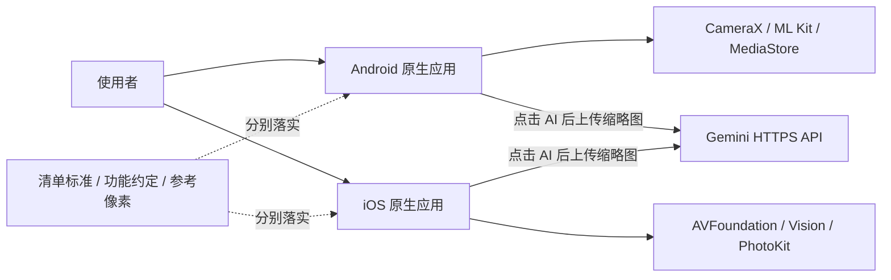
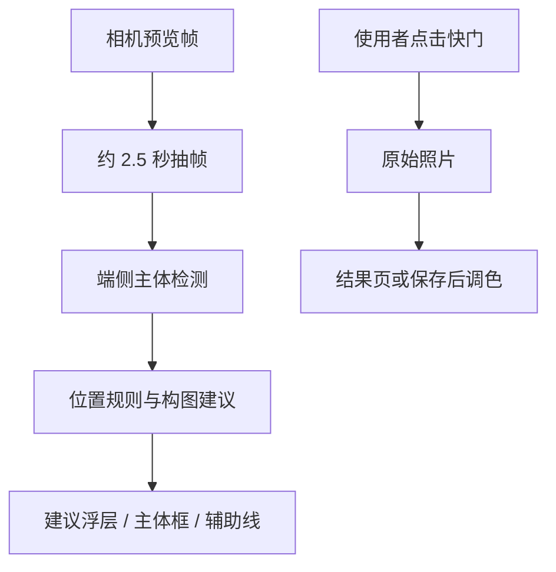
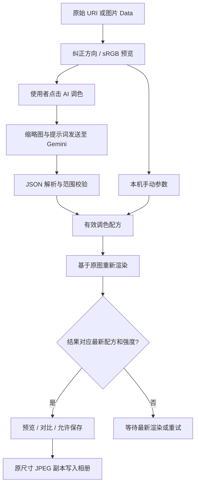

# CompositionHelper 双端架构

更新：2026-09-10。依据：Android 清单实现 `4e284f7`、iOS 清单实现 `7535b84` 及其前置代码。文档描述当前实现；目标规范见 [UI 与交互约定](DESIGN_SYSTEM.md)，缺口见 [已知问题](KNOWN_ISSUES.md)。源码路径按所属分支查看。

## 1. 系统边界

这是一个仓库中的两套原生应用：`master` 是 Kotlin/Jetpack Compose，`ios` 是 Swift/SwiftUI。没有共享运行时、跨平台 UI 框架或自建业务后端。两端以功能约定、清单 JSON 和参考像素建立一致性；修改一端不会自动更新另一端。

实时构图建议在设备上处理；拍后 AI 调色才调用 Gemini。建议分数不等于经校准的审美评分。没有对象分割、生成式重绘、用户账号服务或检查记录云同步。

## 2. 模块与职责

| 职责 | Android：master | iOS：ios |
|---|---|---|
| 应用入口与导航 | `MainActivity.kt`、`CompositionHelperNavigation`；Navigation Compose | `CompositionHelperApp.swift`、`ContentView.swift`；SwiftUI sheet/cover |
| 实时相机 | `camera/CameraCompositionScreen.kt`、`CameraManager.kt` | `Camera/CameraCompositionView.swift`、`CameraManager.swift` |
| 实时检测与建议 | `camera/FrameAnalyzer.kt`、ML Kit | `Camera/FrameAnalyzer.swift`、Vision |
| 静态构图分析 | `ImageAnalyzer.kt`、`CompositionHelperApp.kt` | `Analyzers/CompositionAnalyzer.swift`、`Views/CompositionHelper.swift` |
| 辅助线及坐标 | `overlay/`、`camera/CameraGeometry.kt`、`model/SpiralGeometry.kt` | `Views/Overlays/CompositionOverlays.swift`、`Models/CompositionType.swift` |
| 调色编辑状态 | `color/ColorEditorScreen.kt`，Compose 状态与协程 | `Color/ColorEditorModel.swift`，ObservableObject / MainActor |
| 配方与像素处理 | `color/ColorPlan.kt`、`ColorPlanEngine.kt` | `Color/ColorPlan.swift`、`ColorPixelEngine` |
| 图片读取与保存 | `color/ColorPhotoStore.kt` | `Color/ColorPhotoService.swift` actor |
| AI 通信 | `GeminiColorClient.kt`、`GeminiColorProtocol.kt` | `GeminiColorService`，位于 `ColorPhotoService.swift` |
| 真人清单 | `checklist/ShootingChecklistScreen.kt` | `Components/ShootingChecklistView.swift` |

Android 源码根目录为 `app/src/main/java/com/example/compositionhelper/`，iOS 为 `Sources/`。模块是源码职责划分，不是独立发布的 SDK。

## 3. 页面入口与导航

Android 默认进入 `camera`，另有 `gallery`、`samples`、`color?uri=...` 路由。快门保存原片后把 URI 交给调色页面。清单作为相机上的全屏 Dialog，不属于单独导航路由。

iOS 默认展示 `CameraCompositionView`；相机可打开调色 sheet、清单 sheet，以及拍摄结果 fullScreenCover。拍摄结果可以再进入调色。`CompositionHelperView` 静态相册分析页面存在，但 `ContentView.showGalleryMode` 当前没有置为 true 的路径，相机底部相册图标调用 dismiss，因此不能把“相册分析主入口”当作已连通。调色页自身的 PhotosPicker 仍可用于导入照片。

## 4. 实时相机数据流

Android 用 CameraX ViewPort 关联预览、检测与照片画幅；几何辅助函数处理旋转和裁剪。退出时关闭检测器及相机会话，过期帧结果有过滤。iOS 在串行 `sessionQueue` 配置 AVFoundation，会话输入复用；Vision 结果回主线程发布。两端的坐标映射实现不同，不能用 Android 几何测试替代 iOS 真机框线对齐检查。

19 种辅助线不代表智能算法覆盖全部 19 种构图。拍照预览比例、成片裁切和旋转必须通过真实照片核对。

## 5. 拍后调色数据流

管线顺序：基础七参数 → 九点曲线 → HSL 色域 → 明暗色彩平衡 → RGB 校色 → 总强度混合。曲线/HSL/色彩平衡可来自 AI；当前手动面板主要编辑基础项、RGB 和总强度。RGB 原色与互补模式是不同运算，不可当成等价白平衡。

Android 的预览通过 `LaunchedEffect` 按源图、配方和强度重启；`renderedRecipe/renderedStrength` 防止保存旧结果。iOS 用任务取消、generation 标识和 `renderedPlan/renderedStrength` 判断 `ready`。两端都保留最多 20 次撤销快照；Android 部分编辑状态支持 Compose 状态恢复，iOS 编辑状态仅属于当前编辑器实例。

Android 使用 IO/Default 调度器读取和计算；iOS 图片工作在 actor，界面状态在 MainActor。当前都是 CPU 像素处理，原尺寸导出仍需实测内存及耗时。iOS 预览最长边 1400，导出超过 3200 万像素会明确拒绝；Android 采用自己的采样规则，不能假定同一预览尺寸。

## 6. 网络与数据边界

只有主动点击 AI 才发送重新编码的 JPEG 缩略图及提示词；不附原片 EXIF。网络固定到 Gemini HTTPS 接口，两端均禁止重定向并限制响应大小。API Key 放请求头，不写进安装包、日志或持久化设置。

Android Key 保存在进程级 `GeminiColorSession`；iOS 保存在当前 `ColorEditorModel`。生命周期并不相同。应用不代理 Apple 账号登录；iloader 属于外部安装工具。详细数据去向见 [数据与隐私](DATA_PRIVACY.md)。

## 7. 真人清单状态

标准为 [SHOOTING_CHECKLIST.json](SHOOTING_CHECKLIST.json)：3 组、12 个稳定 ID。原生代码各保留一份条目，运行时不读取这个 JSON；因此变更时必须同步 JSON 和两端代码，不能只修改文档。

状态为 `pending / confirmed / problem / skipped`，缺失或未知状态按待检查处理。只有使用者操作状态菜单才会改变结果。`confirmed` 计入已确认；问题和不适用单独计数。它不是自动测试服务，也不读取相机或 AI 成功信号来勾选。

Android 保存到 `shooting_checklist` SharedPreferences；iOS 用标准 UserDefaults / AppStorage。键为 `shooting.checklist.v1` 和 `shooting.checklist.notes.v1`。状态采用 `id=state;...` 字符串，备注单独保存。重置需确认，清空本轮记录不删除照片；导出通过系统分享面板生成文本。

## 8. 构建与验证架构

Android：Gradle 单 app 模块，APK 编译、JVM 算法/几何测试、AndroidTest 交互测试三者独立。现有 Android CI 只构建 APK，尚未自动执行全部回归。

iOS：Xcode 工程是 App 打包入口；`Package.swift` 不是已经验证的独立分发路径。CI 构建模拟器并截图，运行 Swift 核心检查；另一个 workflow 生成未签名 IPA。Debug 启动参数可以直达编辑器和清单，Release 不启用该检查入口。

[测试指南](TESTING.md)说明如何执行，[开发验收表](CROSS_PLATFORM_ACCEPTANCE.md)记录结论，[版本交付记录](RELEASES.md)将证据绑定到具体提交。截图、编译或算法通过均不能替代真人拍摄验收。
