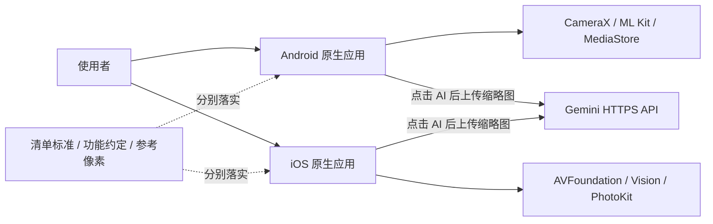
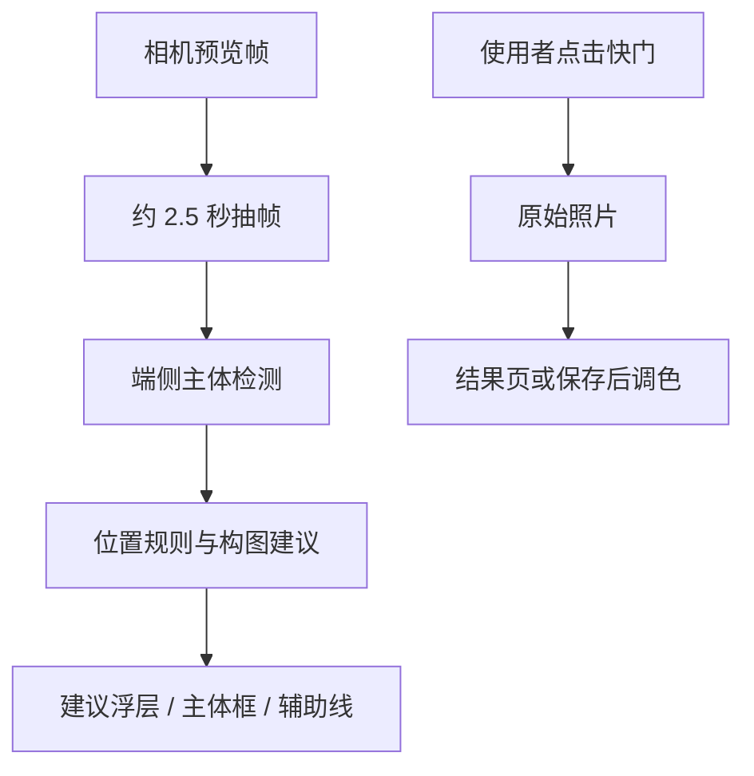
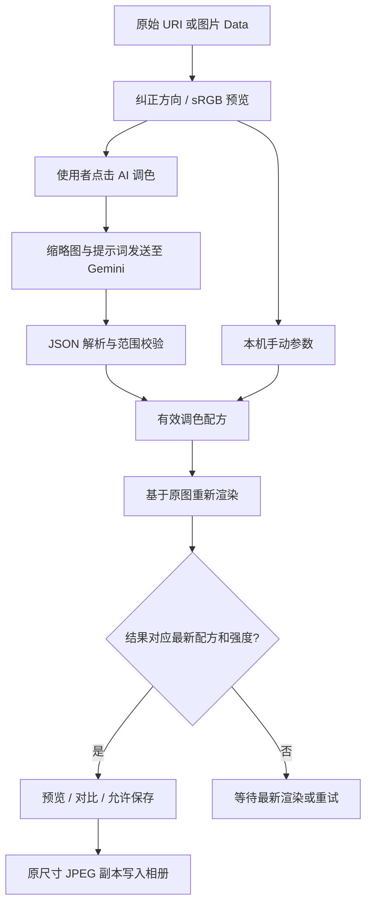
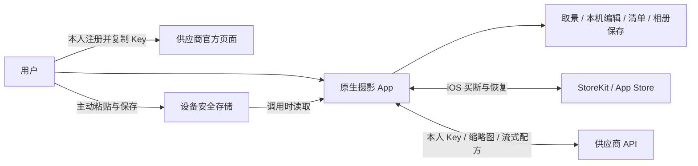

# CompositionHelper 双端架构

更新：2026-09-10。当前实现基线：Android 流式版本 `08a7451`、iOS 流式版本 `a96bfc4`。第 1–8 节和流式补充描述已实现能力；第 9 节起为商业化目标设计，尚未实现。产品方向见 [产品定位与商业化路线](../product/PRODUCT_STRATEGY.md)；目标规范见 [UI 与交互约定](DESIGN_SYSTEM.md)，缺口见 [已知问题](../testing/KNOWN_ISSUES.md)。源码路径按所属分支查看。

## 1. 系统边界

这是一个仓库中的两套原生应用：`master` 是 Kotlin/Jetpack Compose，`ios` 是 Swift/SwiftUI。没有共享运行时、跨平台 UI 框架或自建业务后端。两端以功能约定、清单 JSON 和参考像素建立一致性；修改一端不会自动更新另一端。

实时构图建议在设备上处理；拍后 AI 调色才调用 Gemini。建议分数不等于经校准的审美评分。没有对象分割、生成式重绘、用户账号服务或检查记录云同步。

## 2. 模块与职责

| 职责 | Android：master | iOS：ios |
|---|---|---|
| 应用入口与导航 | `MainActivity.kt`、`CompositionHelperNavigation`；Navigation Compose | `CompositionHelperApp.swift`、`ContentView.swift`；SwiftUI sheet/cover |
| 实时相机 | `camera/CameraCompositionScreen.kt`、`CameraManager.kt` | `Camera/CameraCompositionView.swift`、`CameraManager.swift` |
| 实时检测与建议 | `camera/FrameAnalyzer.kt`、ML Kit | `Camera/FrameAnalyzer.swift`、Vision |
| 静态构图分析 | `ImageAnalyzer.kt`、`CompositionHelperApp.kt` | `Analyzers/CompositionAnalyzer.swift`、`Views/CompositionHelper.swift` |
| 辅助线及坐标 | `overlay/`、`camera/CameraGeometry.kt`、`model/SpiralGeometry.kt` | `Views/Overlays/CompositionOverlays.swift`、`Models/CompositionType.swift` |
| 调色编辑状态 | `color/ColorEditorScreen.kt`，Compose 状态与协程 | `Color/ColorEditorModel.swift`，ObservableObject / MainActor |
| 配方与像素处理 | `color/ColorPlan.kt`、`ColorPlanEngine.kt` | `Color/ColorPlan.swift`、`ColorPixelEngine` |
| 图片读取与保存 | `color/ColorPhotoStore.kt` | `Color/ColorPhotoService.swift` actor |
| AI 通信 | `GeminiColorClient.kt`、`GeminiColorProtocol.kt` | `GeminiColorService`，位于 `ColorPhotoService.swift` |
| 真人清单 | `checklist/ShootingChecklistScreen.kt` | `Components/ShootingChecklistView.swift` |

Android 源码根目录为 `app/src/main/java/com/example/compositionhelper/`，iOS 为 `Sources/`。模块是源码职责划分，不是独立发布的 SDK。

## 3. 页面入口与导航

Android 默认进入 `camera`，另有 `gallery`、`samples`、`color?uri=...` 路由。快门保存原片后把 URI 交给调色页面。清单作为相机上的全屏 Dialog，不属于单独导航路由。

iOS 默认展示 `CameraCompositionView`；相机可打开调色 sheet、清单 sheet，以及拍摄结果 fullScreenCover。拍摄结果可以再进入调色。`CompositionHelperView` 静态相册分析页面存在，但 `ContentView.showGalleryMode` 当前没有置为 true 的路径，相机底部相册图标调用 dismiss，因此不能把“相册分析主入口”当作已连通。调色页自身的 PhotosPicker 仍可用于导入照片。

## 4. 实时相机数据流

Android 用 CameraX ViewPort 关联预览、检测与照片画幅；几何辅助函数处理旋转和裁剪。退出时关闭检测器及相机会话，过期帧结果有过滤。iOS 在串行 `sessionQueue` 配置 AVFoundation，会话输入复用；Vision 结果回主线程发布。两端的坐标映射实现不同，不能用 Android 几何测试替代 iOS 真机框线对齐检查。

19 种辅助线不代表智能算法覆盖全部 19 种构图。拍照预览比例、成片裁切和旋转必须通过真实照片核对。

## 5. 拍后调色数据流

管线顺序：基础七参数 → 九点曲线 → HSL 色域 → 明暗色彩平衡 → RGB 校色 → 总强度混合。曲线/HSL/色彩平衡可来自 AI；当前手动面板主要编辑基础项、RGB 和总强度。RGB 原色与互补模式是不同运算，不可当成等价白平衡。

Android 的预览通过 `LaunchedEffect` 按源图、配方和强度重启；`renderedRecipe/renderedStrength` 防止保存旧结果。iOS 用任务取消、generation 标识和 `renderedPlan/renderedStrength` 判断 `ready`。两端都保留最多 20 次撤销快照；Android 部分编辑状态支持 Compose 状态恢复，iOS 编辑状态仅属于当前编辑器实例。

Android 使用 IO/Default 调度器读取和计算；iOS 图片工作在 actor，界面状态在 MainActor。当前都是 CPU 像素处理，原尺寸导出仍需实测内存及耗时。iOS 预览最长边 1400，导出超过 3200 万像素会明确拒绝；Android 采用自己的采样规则，不能假定同一预览尺寸。

## 6. 网络与数据边界

只有主动点击 AI 才发送重新编码的 JPEG 缩略图及提示词；不附原片 EXIF。网络固定到 Gemini HTTPS 接口，两端均禁止重定向并限制响应大小。API Key 放请求头，不写进安装包、日志或持久化设置。

Android Key 保存在进程级 `GeminiColorSession`；iOS 保存在当前 `ColorEditorModel`。生命周期并不相同。应用不代理 Apple 账号登录；iloader 属于外部安装工具。详细数据去向见 [数据与隐私](../reference/DATA_PRIVACY.md)。

## 7. 真人清单状态

标准为 [SHOOTING_CHECKLIST.json](../reference/SHOOTING_CHECKLIST.json)：3 组、12 个稳定 ID。原生代码各保留一份条目，运行时不读取这个 JSON；因此变更时必须同步 JSON 和两端代码，不能只修改文档。

状态为 `pending / confirmed / problem / skipped`，缺失或未知状态按待检查处理。只有使用者操作状态菜单才会改变结果。`confirmed` 计入已确认；问题和不适用单独计数。它不是自动测试服务，也不读取相机或 AI 成功信号来勾选。

Android 保存到 `shooting_checklist` SharedPreferences；iOS 用标准 UserDefaults / AppStorage。键为 `shooting.checklist.v1` 和 `shooting.checklist.notes.v1`。状态采用 `id=state;...` 字符串，备注单独保存。重置需确认，清空本轮记录不删除照片；导出通过系统分享面板生成文本。

## 8. 构建与验证架构

Android：Gradle 单 app 模块，APK 编译、JVM 算法/几何测试、AndroidTest 交互测试三者独立。现有 Android CI 只构建 APK，尚未自动执行全部回归。

iOS：Xcode 工程是 App 打包入口；`Package.swift` 不是已经验证的独立分发路径。CI 构建模拟器并截图，运行 Swift 核心检查；另一个 workflow 生成未签名 IPA。Debug 启动参数可以直达编辑器和清单，Release 不启用该检查入口。

[测试指南](../testing/TESTING.md)说明如何执行，[开发验收表](../testing/CROSS_PLATFORM_ACCEPTANCE.md)记录结论，[版本交付记录](../testing/RELEASES.md)将证据绑定到具体提交。截图、编译或算法通过均不能替代真人拍摄验收。

## 流式调色状态补充

双端 AI 客户端现使用 SSE；结构化文本只在顶层参数组闭合后送入原有配方校验器。通过校验的部分方案只更新独立临时预览，不修改正式配方和撤销历史。STOP 与完整配方校验通过后，先生成最终预览，再原子提交配方与可保存状态。取消/失败清除临时预览。请求取消、限流渲染、大小限制及耗时口径见 [流式调色文档](AI_STREAMING.md)。

## 9. 买断与自带 Key 架构（用户确认方向，待实施）

核心功能一次付费全部解锁，AI 使用用户自己的 Key 并在本机安全保存；无订阅、AI 次数包、应用账号或自建业务后端。此决策取代前一轮小后端/额度账本建议。工具买断与供应商的模型费用分开说明，不能宣传为买断无限免费云端 AI。定位见 [PRODUCT_STRATEGY.md](../product/PRODUCT_STRATEGY.md)。

官网帮助和隐私政策可以使用静态托管，不接收照片或 Key。没有用户数据库、购买代理、任务队列、AI 额度或第三方登录服务。第三方 AI 仍依赖网络与供应商账号，不能将整体产品描述为完全离线。

## 10. 买断权益模块

iOS 增加 `PurchaseService` 与 `EntitlementStore`，默认采用一个非消耗型商品解锁全部核心工具。读取本地化价格，处理取消、pending、签名验证、交易更新、退款撤销和用户主动恢复购买。权益不以可编辑的 UserDefaults 布尔值为唯一依据。本机已有有效权益在离线时仍可使用，联网后刷新撤销状态。[StoreKit 2](https://developer.apple.com/storekit/)

用户只用 App Store 购买体系，不再注册本应用账号。买断入口与 AI Key 配置分开：Key 不解锁付费权益。收费实现、正式应用标识和商品配置尚未完成；当前 iloader 测试包不能替代 StoreKit Sandbox/TestFlight 支付验证。

Android 的支付方式按所选渠道单独设计，设备存储与 AI 引导保持统一，不默认共享 Apple 购买权益。

## 11. 设备安全存储

| 平台 | 目标实现 | 存储边界 |
|---|---|---|
| iOS | `CredentialStore` 使用 Keychain 的 generic password；明确 service/account 与供应商标识，使用仅本设备且解锁可访问的属性 | 不开启 iCloud 同步，不写 UserDefaults；当前编辑器按需读入内存 |
| Android | Android Keystore 创建不可导出的 AES 密钥，AES-GCM 加密用户 API Key；随机独立 nonce，保存密文和必要版本信息 | 密文放应用 noBackupFilesDir，排除备份；不把 API Key 当作 Keystore 私钥条目 |

保存按钮明确表示用户同意在本机持久化；成功写入后才显示“已保存”。写入错误、密钥失效或设备锁定不能降级成明文文件。替换失败保留旧凭据；更换或清除先取消本次 AI 请求，再删除/替换安全存储和运行中缓存，避免旧请求继续使用缓存的 Key；已发送的上游请求仍按供应商实际计费。模型名称等非秘密偏好可独立存储。卸载、迁移或重新签名后不保证能够恢复，iOS 也不能依赖卸载作为唯一清除 Key 的方式。

这是减少重复填写的方案，不是无法被攻破的保证。当前直连模式中运行时需要取得用户 Key；不能内置开发者通用 Key，也不能把加密后随 App 分发的公共凭据称为安全方案。[Apple Keychain](https://developer.apple.com/documentation/security/keychain-services)、[Android Keystore](https://developer.android.com/privacy-and-security/keystore)

当前代码仍只保存内存 Key。上述持久化属于后续实现，不改变第 6 节对现有数据行为的描述。

## 12. 首次连接 AI 的引导模块

增加 `AISetupView / AISetupScreen` 与供应商配置元数据，元数据仅包括官方帮助地址、API 固定地址及已验证默认模型，不含任何 Key。状态为未配置、查看官方帮助、输入、保存中、已保存、配置错误；“已保存”不能等同于网络验证通过。

默认流程为：获取我的 Key → 官方页面本人登录/注册并复制 → 回到 App 主动粘贴 → 保存到此设备。已有 Key 可跳过帮助。保存仅做本机格式检查，首次实际 AI 调色才发起图像请求；不为验证密钥暗中上传照片或发起额外模型调用。高级模型配置折叠，错误按权限、地区、模型、网络和额度分类。

应用不替用户注册，不收集供应商密码，不自动抓取登录后页面，不在回跳 URL 中传 Key，不后台读取剪贴板。官方流程、页面跳转与数据同意见 [BYOK_ONBOARDING.md](BYOK_ONBOARDING.md)。Gemini 只是当前已实现供应商，目标地区确认后再确定首发引导，不自动添加未经验证的接口。

## 13. 保持现有流式和隐私边界

从 `CredentialStore` 读取用户凭据后调用现有网络适配器，仍保持单次主动请求、完整参数组校验、临时预览、取消与最终成功后才可保存。解密凭据不进入计划 JSON、截图、检查清单或诊断日志。没有自建服务代收图片。

可抽出 `ColorAnalysisProvider` 支持未来供应商，适配器必须通过图片输入、JSON 范围、流式截断与失败恢复测试后才出现在用户界面。不要把任意服务地址与 Key 放在默认新手页面；新增目的地应重新确认数据去向。

首次上传前明确说明选中照片的缩略图会发送到所选 AI 供应商，并取得同意。免费与付费账号的数据处理规则可能不同，不承诺全离线或第三方完全不留存；设置成功不表示账号永久有效或无模型费用。

## 14. 实施状态与验收

已实现：两端本机编辑、真人清单、Gemini 流式直连。待实现：单笔买断、Key 安全持久化和三步新手引导。小后端、AI 次数包及账号体系不在当前路线。

持久化验收覆盖重启、替换失败、清除、系统锁定和重签名；引导需在目标地区用新/旧账号实测。StoreKit 独立验证购买取消、pending、恢复与撤销。计划见 [PRODUCT_STRATEGY.md](../product/PRODUCT_STRATEGY.md)，实际已构建内容见 [RELEASES.md](../testing/RELEASES.md)。
